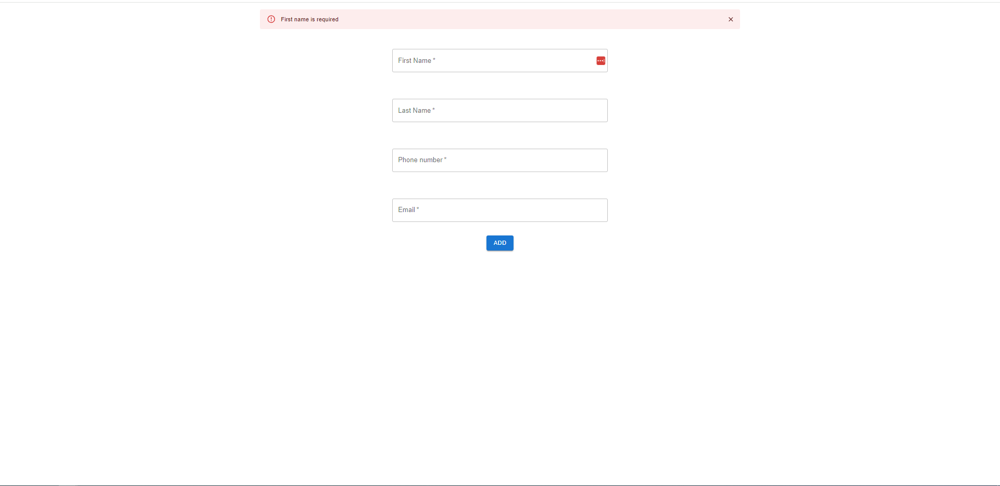
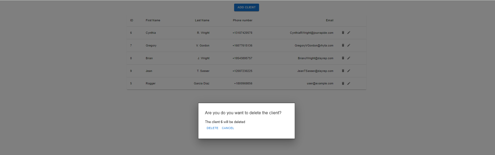
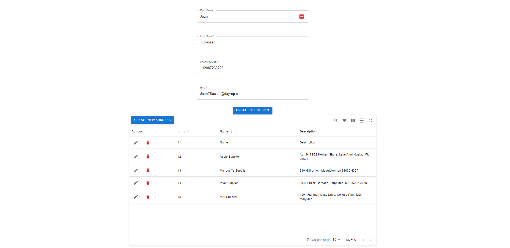
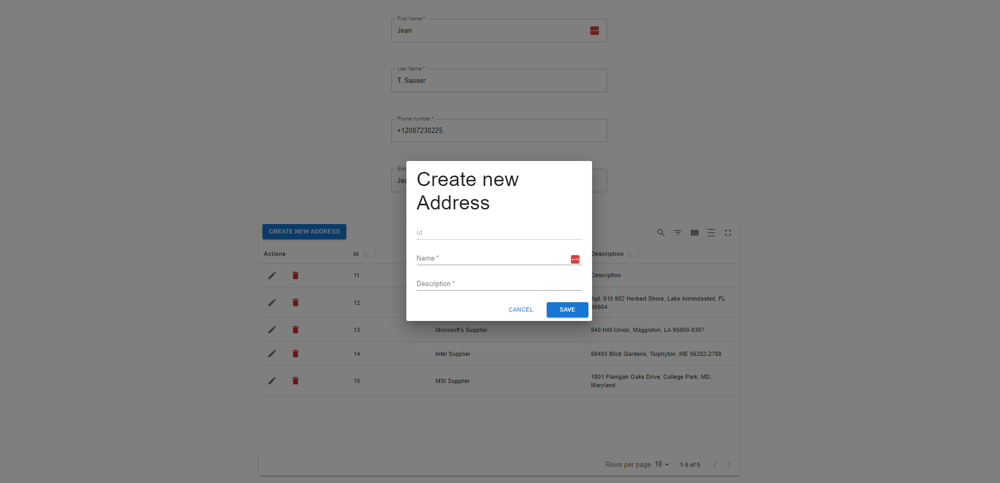
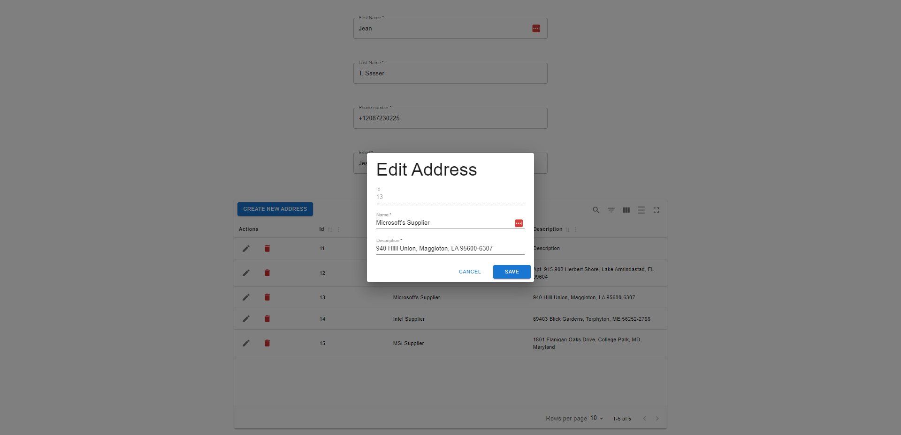
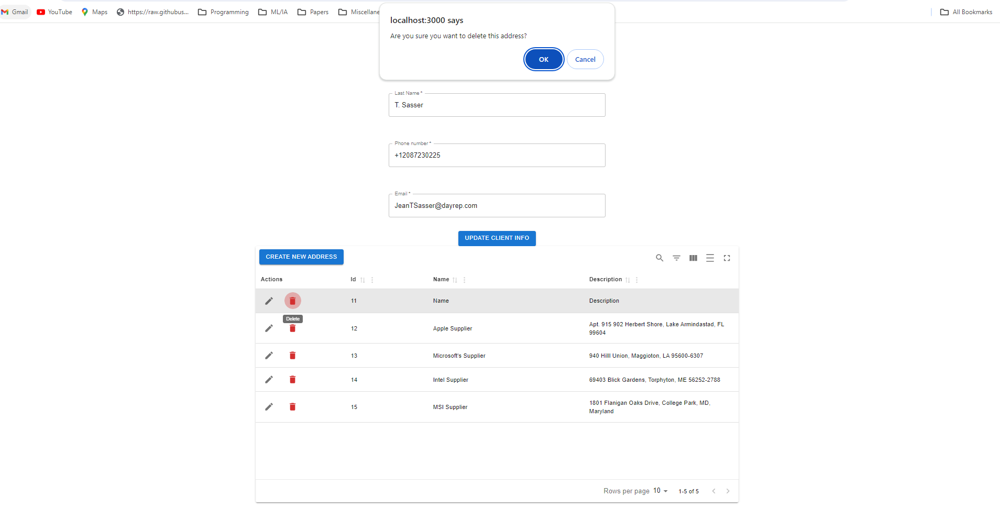
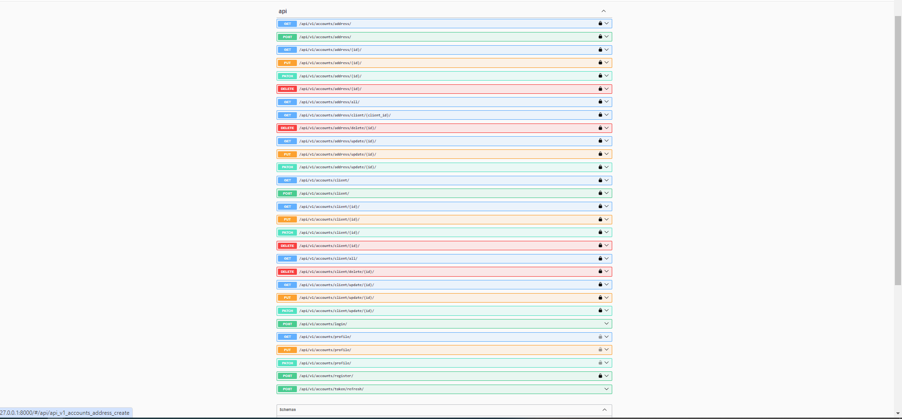

<h1 align="center">Django | React | PostgreSQL Interview Test</h1>


## Features 

  -  Django REST framework for a powerful API
  -  Authentication With JWT
  -  Throttle setup
  -  PostgreSQL supported
  -  Dockerize Application
  -  TestDriven Development with Pytest
  

## Step 1

create **.env** file in root folder.
```
DB_USER=postgres
DB_PASSWORD=dbpassword
DB_NAME=dbname
DB_PORT=5432
DB_HOST=localhost
```
If you want to run the project locally, just modify the file `backend\config\setting.py`:
```
DATABASES = {
    'default': {
    'ENGINE': 'django.db.backends.postgresql',
    'NAME': os.getenv("DB_NAME", '<your-database-name>'),
    'USER': os.getenv("DB_USER", '<your-username>'),
    'PASSWORD': os.getenv("DB_PASSWORD", '<you-port>'),
    'HOST': os.getenv("DB_HOST", '<your-host> (by default localhost)'),
    'PORT': os.getenv("DB_PORT", '<your-port> (by default 5432)')
    }
}
```

## Step 2

### Run using docker
```
docker-compose up --build
```

### Run locally
```
cd frontend
npm install
cd ..
cd backend
python manage.py makemigrations
python manage.py migrate admin
python manage.py migrate auth 
python manage.py migrate  --run-syncdb
python manage.py runserver
cd frontend
npm start
```
###  Your Production Ready Application is up and running on `localhost:3000`

- Swagger docs on `localhost:8000/`

- Your Application on `localhost:3000/`


## Images

### Client Layout
<p align="center">
  
</p>

### Add Client
<p align="center">
  
</p>

### Delete Client
<p align="center">
  
</p>

### Addresses Layout
<p align="center">
  
</p>

### Add Address 
<p align="center">
  
</p>

### Update Address 
<p align="center">
  
</p>

### Delete Address 
<p align="center">
  
</p>

### Swagger
<p align="center">
  
</p>
